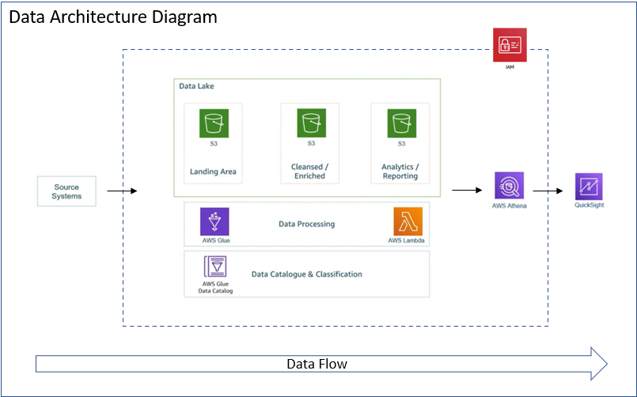

# 📊 AWS ETL Pipeline on YouTube Trending Data

This project showcases how to build a scalable, serverless ETL pipeline using AWS services to analyze YouTube trending video datasets.

---

## 📌 Project Overview

The pipeline demonstrates how to:
- Ingest raw CSV and JSON datasets into AWS S3
- Transform JSON to Parquet using AWS Lambda
- Clean and enrich CSV data using AWS Glue Spark jobs
- Query data with AWS Athena
- Visualize insights using Amazon QuickSight

---

## 🧱 Architecture Diagram

---

## 🛠️ Tech Stack

- **AWS Services**: S3, Lambda, Glue, Glue Data Catalog, Athena, IAM, QuickSight  
- **Programming**: Python, Shell, SQL  
- **Libraries**: pandas, awswrangler  
- **Tools**: PySpark, Glue Studio, Athena Console, QuickSight UI

---